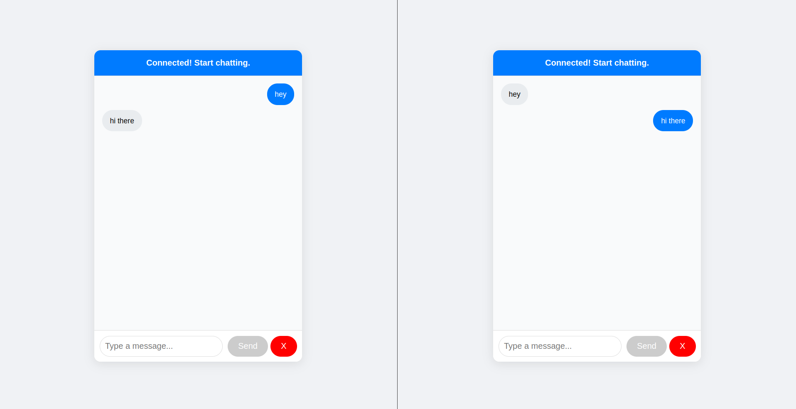

# GoChat - Chat Application

GoChat is a simple chat application built with Go and bootstrapped using Docker Compose.

## Project Structure

- **Dockerfile**: Configuration for building the application container.
- **Dockerfile.nginx**: Configuration for the Nginx reverse proxy.
- **docker-compose.yml**: Compose file to manage multiple services.
- **go.mod**: Go module dependencies.
- **go.sum**: Checksums for the module dependencies.

## Application Preview



## Features

- Real-time chat functionality
- Scalable architecture
- Fully containerized using Docker Compose

## How to Run

1. Clone the repository:
   ```bash
   git clone <repo-url>
   cd chat-app
   ```

2. Build and start the services with Docker Compose:
      ```bash
   docker-compose up --build
   ```
3. Hit browser on localhost (open in multiple tabs to simulate multiple users)
